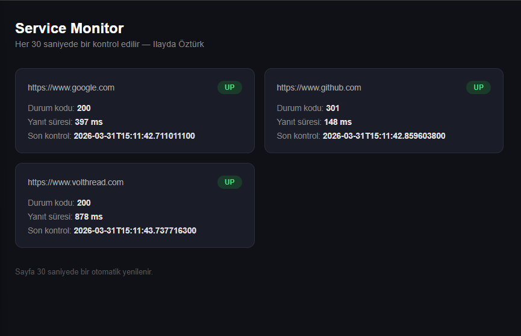
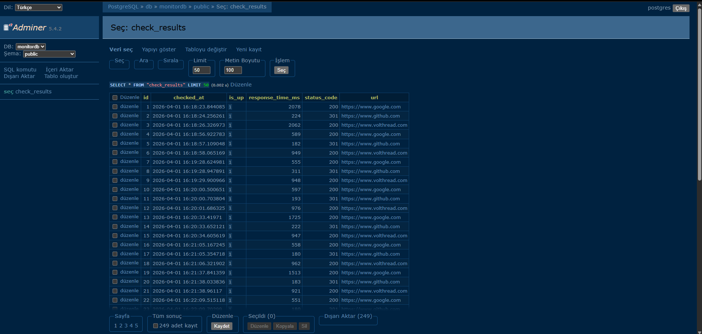

# Service Monitor

A lightweight service monitoring tool built with Spring Boot and PostgreSQL. Monitors web service availability every 30 seconds and stores results in a database.

Inspired by enterprise monitoring tools like [Volthread VOI](https://www.volthread.com/tr/urunler/voi-volthread-webservis-izleme-ve-olay-yonetimi-cozumu/).

## What it does

- Periodically checks the availability of web services every 30 seconds
- Stores results in PostgreSQL database
- Displays HTTP status codes and response times
- Shows UP/DOWN status with a clean dashboard
- Auto-refreshes every 30 seconds

## Tech Stack

- Java 21
- Spring Boot 4.0.5
- Spring Web + Thymeleaf
- Spring Data JPA + PostgreSQL
- Docker + Docker Compose
- Maven

## How to run

### Prerequisites
- Docker + Docker Compose

### Run with Docker Compose
```bash
docker-compose up --build
```

Then open your browser:

- Dashboard: http://localhost:8081
- Database UI: http://localhost:8090

## Screenshots

### Dashboard


### Database (Adminer)


## About

Built by **Ilayda Öztürk** as a portfolio project.  
Inspired by enterprise service monitoring solutions.
